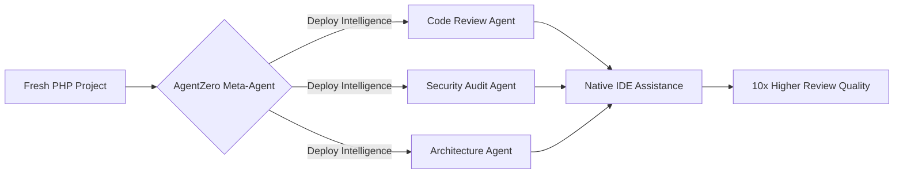

# Awesome Copilot Agents - Open Source

A collection of open-source **AI agents** for software development workflows. Built to work with **GitHub Copilot** and designed to be **model-agnostic** (compatible with GPT-4o, Claude, Gemini, and others). Primary focus on **PHP (Symfony & Laravel)** with extensibility for other stacks.

Each agent can be used as a Copilot command, a standalone agent, or orchestrated together for end-to-end workflows.

---

## Agents

| # | Agent | Owner | Status | Description |
|---|-------|-------|--------|-------------|
| 1 | [Code Review Agent](agents/code-review/) | Rajsee | In Progress | Multi-agent parallel PR review - coding standards, linting, functional review, test coverage, PR quality |
| 2 | [Code Audit Agent](agents/code-audit/) | Mohin | Planned | Audit codebase against specific standards with sub-agents for each standard |
| 3 | [Security Check Agent](agents/security-check/) | Mohin | Planned | Routine security checks - open credentials, vulnerability scanning, production security posture |
| 4 | [Project Estimation Agent](agents/project-estimation/) | Harshil | Planned | Analyze codebase/requirements and generate effort estimations for new and existing projects |
| 5 | [Solution Architect Agent](agents/solution-architect/) | Denish | Planned | System design, R&D, and solution architecture with cost/security/scalability analysis |

---

## Agent Details

### 1. Code Review Agent
Automated PR review system using parallel sub-agents:
- **Coding Standards** - Framework-specific conventions (PSR-12, Symfony/Laravel patterns)
- **Linting** - Static analysis and code style enforcement
- **Functional Review** - Business logic validation against project constitution (requires team input to build context)
- **Test Coverage** - Verifies test presence and quality for changed code
- **PR Quality** - Checks that PR contains proper description, linked tickets, and context
- **GitHub Integration** - Instructions for GitHub web so Copilot can auto-trigger reviews on PRs

### 2. Code Audit Agent
Deep codebase auditing against defined standards:
- Accepts audit standards as input (e.g., company-specific coding standards document)
- **Sub-agent orchestration** - Spawns specialized sub-agents for each standard category
- Produces structured audit reports with findings and recommendations

### 3. Security Check Agent
Routine security scanning for codebases:
- Open credentials and secrets detection
- Dependency vulnerability scanning
- Production security configuration review
- Engineering and security checklist validation
- References PM/engineering/production security standards

### 4. Project Estimation Agent
Comprehensive project estimation from requirements:
- **Existing projects** - Analyze codebase + requirements to estimate remaining work
- **New projects** - R&D-driven estimation from scratch
- Considers billing, sales criteria, and business requirements
- Detects **functional requirement gaps** (e.g., login mentioned but not signup)
- Gathers context from pre-sale recordings, SOW documents, and web research
- Covers full stack: Frontend, Backend, DevOps, Design, Mobile
- Multi-tech-stack analysis when applicable
- Figma design analysis for scope estimation
- Third-party integration assessment (payments, notifications, SSO)
- Database design review (new) or existing DB analysis
- Dockerization and infrastructure considerations
- Code audit document preparation with recommendations
- Security considerations in estimation
- Separate agents for existing vs greenfield projects

### 5. Solution Architect Agent
System design and technical solution generation:
- End-to-end solution architecture with R&D
- Structured template covering:
  - Cost effectiveness analysis
  - Solution definition and approach
  - Efficiency and performance considerations
  - Security architecture
  - Scalability planning
  - Timeline and effort estimation
  - Language/framework constraints
  - Cloud provider reliability comparison
  - Third-party service evaluation
  - Existing codebase alignment (when project instructions are provided)

---

## Design Principles

### Orchestration & Alignment
All agents follow a shared structure and prompting pattern. When agents work together, they maintain:
- Consistent output formats (JSON-based findings)
- Shared context protocols
- Compatible orchestration patterns for chaining agents

### Model Agnostic
Agents are designed to work with any LLM. Token usage is optimized in agent prompts to stay within context limits across different models. Each agent documents its token requirements and supported models.

### Framework-Aware (PHP Focus)
Primary support for:
- **Symfony** - Doctrine ORM, service container, event subscribers, security voters, form validation, bundle architecture
- **Laravel** - Eloquent ORM, middleware, queue jobs, Blade templates, authorization gates, migration safety

Agents include framework-specific checks out of the box.

---

## Repository Structure

```
awesome-copilot-opensource/
├── README.md
├── agents/
│   ├── code-review/
│   │   ├── README.md
│   │   ├── .github/
│   │   │   ├── agents/              <-- Copilot agent definitions (*.agent.md)
│   │   │   ├── prompts/             <-- Copilot commands (*.prompt.md)
│   │   │   └── instructions/        <-- Context files (*.instructions.md)
│   │   ├── docs/
│   │   └── templates/
│   ├── code-audit/
│   ├── security-check/
│   ├── project-estimation/
│   └── solution-architect/
│
└── shared/
    ├── templates/                   <-- Shared agent templates and output formats
    ├── orchestration/               <-- Common orchestration patterns
    └── standards/                   <-- Shared coding/security standards
```

Each agent is self-contained in its own directory with its own README, setup instructions, and Copilot integration files.

**GitHub Copilot conventions:**
- Agents: `.github/agents/*.agent.md`
- Prompts/Commands: `.github/prompts/*.prompt.md`
- Instructions: `.github/instructions/*.instructions.md`

---

## Quick Start

```bash
# 1. Clone this repo
git clone https://github.com/AwesCopilot/awesome-copilot-opensource.git

# 2. Pick an agent and follow its README
cd agents/code-review/
cat README.md

# 3. Copy the agent files into your PHP project
cp -r .github/ your-project/.github/

# 4. Use via Copilot in your IDE or PR workflow
```

---

## Contributing

Each agent is developed independently. To contribute:

1. Check the agent table above for ownership and status
2. Create a feature branch from `main` (e.g., `feature/code-review-agent`)
3. Follow the shared structure under `agents/<agent-name>/`
4. Include a `README.md` with setup, usage, and supported frameworks
5. Test with real projects before submitting a PR
6. Ensure prompts are optimized for token usage across different models

---

## Notes

- Not all agents expose Copilot commands - some are designed as sub-agents or standalone analysis tools
- Agents should be composable - the output of one agent can feed into another
- Token optimization matters - agents must work within context limits of various models
- Solution Architect (Denish) to review overall structure and tokenization across all agents

---

## License

MIT
```text
  █████╗  ██████╗ ███████╗███╗   ██╗████████╗███████╗███████╗██████╗  ██████╗ 
 ██╔══██╗██╔════╝ ██╔════╝████╗  ██║╚══██╔══╝╚══███╔╝██╔════╝██╔══██╗██╔═══██╗
 ███████║██║  ███╗█████╗  ██╔██╗ ██║   ██║     ███╔╝ █████╗  ██████╔╝██║   ██║
 ██╔══██║██║   ██║██╔══╝  ██║╚██╗██║   ██║    ███╔╝  ██╔══╝  ██╔══██╗██║   ██║
 ██║  ██║╚██████╔╝███████╗██║ ╚████║   ██║   ███████╗███████╗██║  ██║╚██████╔╝
 ╚═╝  ╚═╝ ╚═════╝ ╚══════╝╚═╝  ╚═══╝   ╚═╝   ╚══════╝╚══════╝╚═╝  ╚═╝ ╚═════╝ 
```

# Awesome Copilot Open Source (PHP Edition) 🐘

Elevate your PHP development with expert-engineered **Intelligence Agents**. Seamlessly deploy advanced multi-agent workflows into your IDE (VS Code, Cursor, etc.) to automate PR reviews, security audits, and architectural evaluations.

## 🚀 The Value: Why AgentZero?

Most AI assistants are generic. **AgentZero** delivers **context-aware expertise** specifically for the Laravel and Symfony ecosystems.



### Key Benefits:
- **Expert-Level Guardrails:** Enforce PSR-12, modern PHP patterns, and framework-specific "Project Constitutions."
- **Reduced Hallucinations:** Multi-agent verification ensures every AI claim is backed by real code evidence.
- **Unified Workflow:** One command to "arm" your repository with multiple specialized agents.
- **Cross-AI Ready:** Use the same high-quality logic across Copilot, Gemini, Claude, and more.

## 🤖 Capabilities (Current Agents)

- **🔍 Intelligent PR Review:** 4-phase automated review with hallucination detection and risk scoring.
- **🛡️ PHP Security Audit:** Reading-focused scanning for OWASP vulnerabilities and framework anti-patterns.
- **🏛️ Enterprise Architect:** Automated evaluation of architectural drift and ADR compliance.

---

## 🚀 Quick Start (Deployment)

### 🛡️ Recommended (Safer)
Download, review, and execute the AgentZero bootstrapper:
```bash
# 1. Download the script
curl -sSLo agentzero.sh https://raw.githubusercontent.com/laxit-patel-simform/agentzero/main/bin/agentzero.sh
chmod +x agentzero.sh

# 2. Browse available intelligence
./agentzero.sh list

# 3. Add an agent (e.g., Code Review)
./agentzero.sh add code-review

# 4. Remove an agent
./agentzero.sh remove code-review
```

### ⚡ One-Liner (Convenient)
```bash
# List all agents
curl -sSL https://raw.githubusercontent.com/laxit-patel-simform/agentzero/main/bin/agentzero.sh | bash -s -- list

# Add an agent
curl -sSL https://raw.githubusercontent.com/laxit-patel-simform/agentzero/main/bin/agentzero.sh | bash -s -- add code-review
```

## 🛠️ Internal Maintenance (For Contributors)

This repository includes a set of **Meta-Agents** to help maintain project standards:
- **Assimilator Agent:** An internal agent that ensures all new contributions follow the strict "Intelligence + Stubs" architecture.
- **`/assimilate` Command:** A convenience command to automatically generate manifests and registry entries for new agents.

---

## 📂 Resources
- **[Intelligence Architecture](docs/architecture/php-orchestration.md):** How our 4-phase orchestration works.
- **[Standard Operating Procedures (SOP)](docs/SOP.md):** Detailed guides for users and contributors.
- **[Core Concepts](docs/architecture/concepts.md):** Understanding Intelligence vs. Stubs.

## 🤝 Community
- **[Contributing Guide](CONTRIBUTING.md):** Join us as an Intelligence Engineer.
- **[Code of Conduct](CODE_OF_CONDUCT.md):** Our community standards.
- **[Roadmap](ROADMAP.md):** Upcoming PHP agents and Meta-Agent features.

---
*Built with ❤️ for the PHP Community by Simform.*
