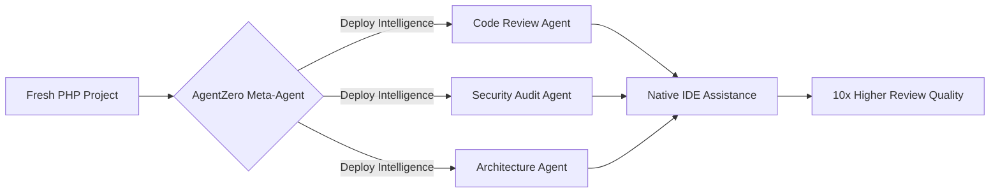

```text
  █████╗  ██████╗ ███████╗███╗   ██╗████████╗███████╗███████╗██████╗  ██████╗ 
 ██╔══██╗██╔════╝ ██╔════╝████╗  ██║╚══██╔══╝╚══███╔╝██╔════╝██╔══██╗██╔═══██╗
 ███████║██║  ███╗█████╗  ██╔██╗ ██║   ██║     ███╔╝ █████╗  ██████╔╝██║   ██║
 ██╔══██║██║   ██║██╔══╝  ██║╚██╗██║   ██║    ███╔╝  ██╔══╝  ██╔══██╗██║   ██║
 ██║  ██║╚██████╔╝███████╗██║ ╚████║   ██║   ███████╗███████╗██║  ██║╚██████╔╝
 ╚═╝  ╚═╝ ╚═════╝ ╚══════╝╚═╝  ╚═══╝   ╚═╝   ╚══════╝╚══════╝╚═╝  ╚═╝ ╚═════╝ 
```

# Awesome Copilot Open Source (PHP Edition) 🐘

Elevate your PHP development with expert-engineered **Intelligence Agents**. Seamlessly deploy advanced multi-agent workflows into your IDE (VS Code, Cursor, etc.) to automate PR reviews, security audits, and architectural evaluations.

## 🚀 The Value: Why AgentZero?

Most AI assistants are generic. **AgentZero** delivers **context-aware expertise** specifically for the Laravel and Symfony ecosystems.



### Key Benefits:
- **Expert-Level Guardrails:** Enforce PSR-12, modern PHP patterns, and framework-specific "Project Constitutions."
- **Reduced Hallucinations:** Multi-agent verification ensures every AI claim is backed by real code evidence.
- **Unified Workflow:** One command to "arm" your repository with multiple specialized agents.
- **Cross-AI Ready:** Use the same high-quality logic across Copilot, Gemini, Claude, and more.

## 🤖 Capabilities (Current Agents)

- **🔍 Intelligent PR Review:** 4-phase automated review with hallucination detection and risk scoring.
- **🛡️ PHP Security Audit:** Reading-focused scanning for OWASP vulnerabilities and framework anti-patterns.
- **🏛️ Enterprise Architect:** Automated evaluation of architectural drift and ADR compliance.

---

## 🚀 Quick Start (Deployment)

You don't need to clone this repo to start using these agents. Just run:

```bash
# 1. Browse Available Intelligence
curl -sSL https://raw.githubusercontent.com/simform-git/awesome-copilot-opensource/main/bin/agentzero.sh | bash -s -- list

# 2. Deploy an Agent (e.g., Code Review)
curl -sSL https://raw.githubusercontent.com/simform-git/awesome-copilot-opensource/main/bin/agentzero.sh | bash -s -- deploy php-code-review
```

---

## 📂 Resources
- **[Intelligence Architecture](docs/architecture/php-orchestration.md):** How our 4-phase orchestration works.
- **[Standard Operating Procedures (SOP)](docs/SOP.md):** Detailed guides for users and contributors.
- **[Core Concepts](docs/architecture/concepts.md):** Understanding Intelligence vs. Stubs.

## 🤝 Community
- **[Contributing Guide](CONTRIBUTING.md):** Join us as an Intelligence Engineer.
- **[Code of Conduct](CODE_OF_CONDUCT.md):** Our community standards.
- **[Roadmap](ROADMAP.md):** Upcoming PHP agents and Meta-Agent features.

---
*Built with ❤️ for the PHP Community by Simform.*
