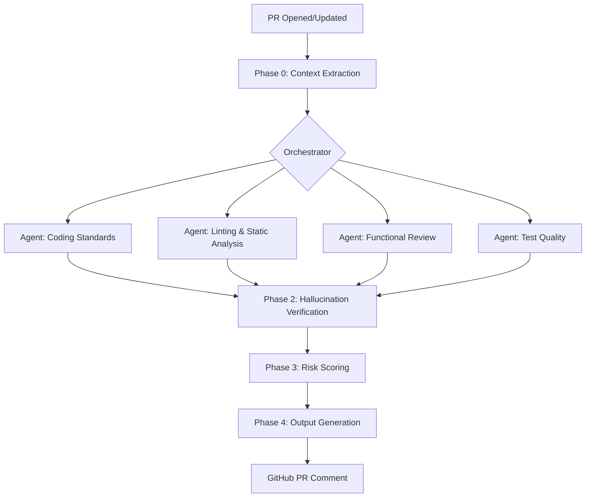
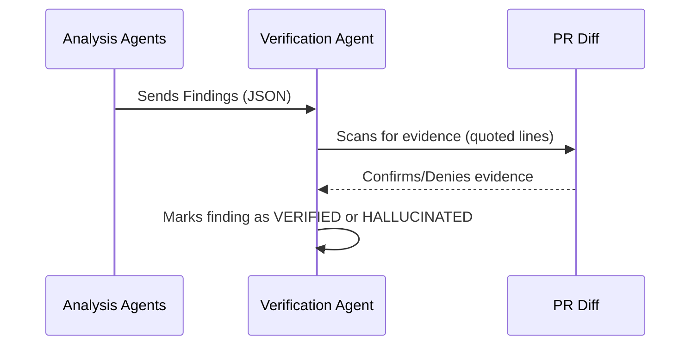

# PHP Orchestration Architecture

This document outlines the multi-agent orchestration architecture used in `awesome-copilot-opensource` for PHP applications.

## Overview

The orchestration follows a **4-Phase Parallel Pipeline** designed to maximize speed while ensuring high accuracy and reducing hallucinations.

## Phase 0: Context Extraction
In this phase, the system identifies the PHP environment and project-specific rules.

- **Framework Detection:** Identifying Laravel vs. Symfony via `composer.json`.
- **Project Constitution:** Reading `project-constitution.md` for team-specific rules.
- **Diff Analysis:** Fetching the PR diff using `gh pr diff`.

## Phase 1: Parallel Analysis
Multiple agents analyze the PR concurrently:

- **Coding Standards:** Checks for PSR-12 and framework-specific patterns.
- **Linting:** Performs "mental" static analysis for type safety and dead code.
- **Functional Review:** Compares logic changes against the Project Constitution.
- **Test Quality:** Ensures new code has corresponding tests and high-quality assertions.

## Phase 2: Hallucination Verification
A critical step where an independent verification agent confirms that every finding is backed by actual code in the PR diff.

## Phase 3: Risk Scoring
The system calculates a risk score (1-10) based on the severity and confidence of the verified findings.

## Phase 4: Output Generation
The final report is formatted into a clear, actionable GitHub PR comment, categorized by severity.
